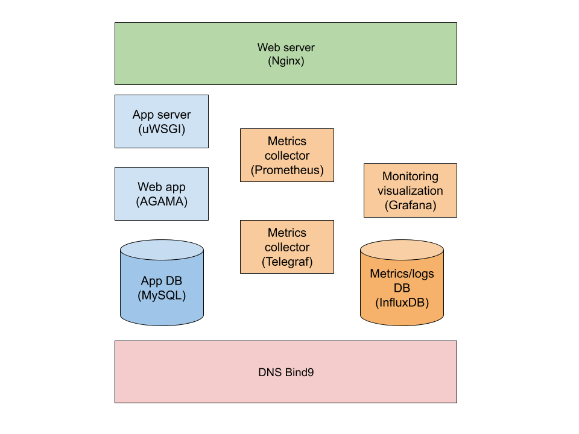

## Backup coverage
### Infrastructure diagram

### What is backed up:
- mysql Database entries
- Grafana
- Ansible repo for obvious reasons

### What is redeployed:
- Nginx
- uwsgi
- agama
- mysql with it's users and db
- Prometheus
- Telegraf
- InfluxDB

### What is **NOT** backed up:
- InfluxDB entries
- Prometheus monitoring data
- any type of logs or monitoring data in general

## Backup RPO (recovery point objective)
I'm thinking new backup every 3 days, increment every day would be nice but this hugely depends on load on machine and their resources, also on my abilities. Time to do backup depends on user activity.

## Versioning and retention
Life length of each backup 10 days

## Usability
at every third backup date, restore latest backup, check readability of previous two, remove forth the oldest. This way we always have at least 1 working backup and we don't delete it unless we are sure we have newer.

## Restoration criteria
When everything crashes and burns

## Backup RTO
this remains to be tested
